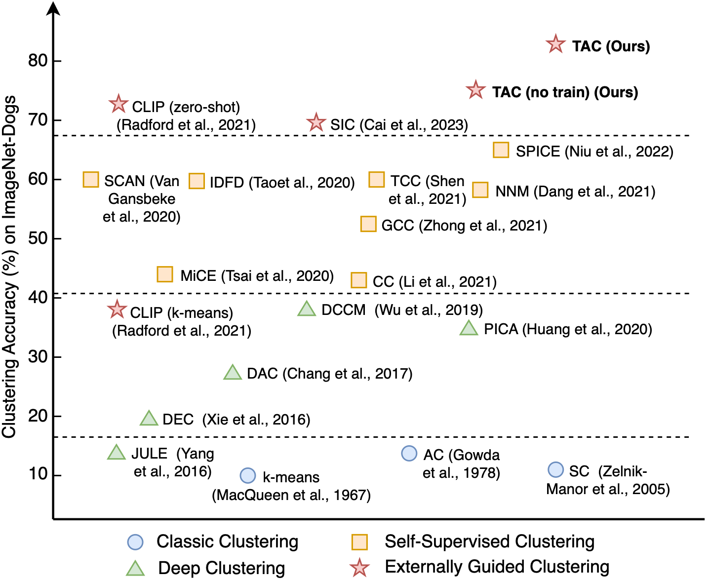
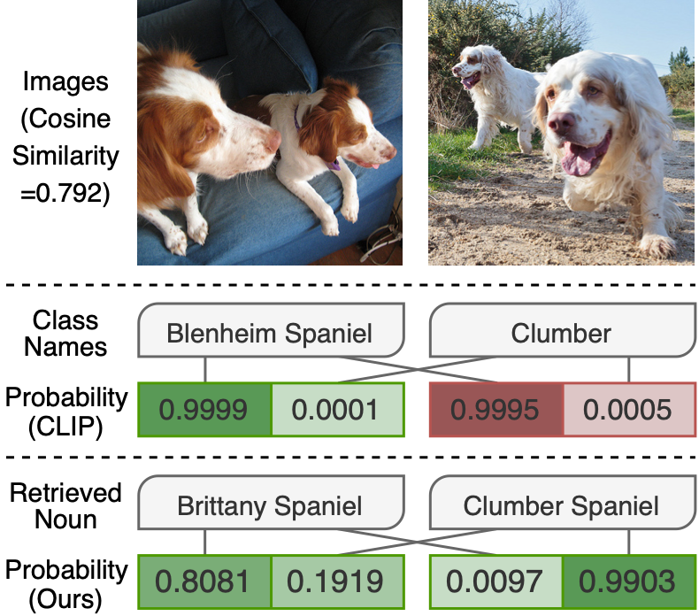
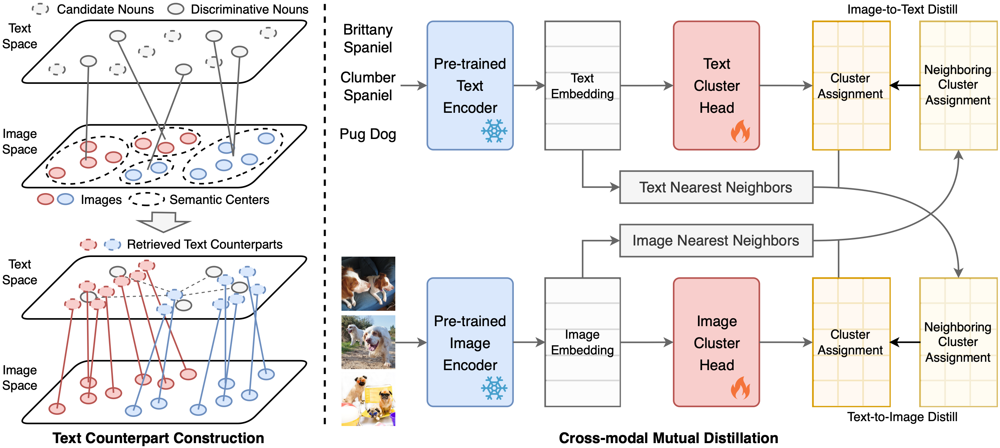

# Image Clustering with External Guidance (TAC)

This is the code for the paper "Image Clustering with External Guidance" (ICML 2024, Oral). Our key idea is to improve image clustering by leveraging the external textual semantics from the pre-trained model, in the absence of class name priors.

<div align=center> </div>

<div align=center></div>

# Dependency

- pytorch>=2.0.1
- torchvision>=0.15.2
- munkres>=1.1.4
- scikit-learn>=1.2.2
- clip>=1.0
- timm>=0.9.2
- faiss-gpu>=1.7.4

# Usage

To improve the readability and extendibility of the code, we split different steps of our TAC method into separate `.py` files. Below is the step-by-step tutorial. Note that the intermediate results would be saved to the `./data` folder.

## Image and Text Embedding Inference
We first need to compute the image embedding with the CLIP model by running

> python image_embedding.py

and the embedding of WordNet nouns (provided in the `./data` folder) for text space construction by running

> python text_embedding.py

## Text Counterpart Construction
Next, we aim to find discriminative nouns to describe image semantic centers. Motivated by the zero-shot classification paradigm of CLIP, we reversely classify all nouns into $k$ image semantic centers and select the top confident nouns for each image semantic center by running

> python filter_nouns.py

The selected nouns compose the text space catering to the input images. Then, we retrieve nouns for each image to compute its counterpart in the text modality by running

> python retrieve_text.py

## Training-free Clustering
After the text counterpart construction, we arrive at an extremely simple baseline by applying $k$-means on the concatenated image and text features by running

> python concat_kmeans.py

Notably, such an implementation requires no additional training or modifications on CLIP, but it could significantly improve the clustering performance compared with directly applying $k$-means on the image embeddings.

## Cluster Heads Training
For better collaboration between image and text features, we train additional cluster heads to further improve the clustering performance by running

> python train_head.py

The training of TAC is extremely efficient, which takes only one minute for the CIFAR-10 dataset.

# Dataset

CIFAR-10, CIFAR-20, STL-10 will be automatically downloaded by Pytorch. ImageNet-10 and ImageNet-dogs are subsets of the ImageNet dataset, with class indices provided [here](https://github.com/Yunfan-Li/Contrastive-Clustering/tree/main/datasets). DTD could be downloaded from https://www.robots.ox.ac.uk/~vgg/data/dtd/. UCF-101 could be downloaded from https://www.crcv.ucf.edu/data/UCF101.php.

# Citation

If you find TAC useful in your research, please consider citing:
```
@inproceedings{
  li2024image,
  title={Image Clustering with External Guidance},
  author={Li, Yunfan and Hu, Peng and Peng, Dezhong and Lv, Jiancheng and Fan, Jianping and Peng, Xi},
  booktitle={Forty-first International Conference on Machine Learning},
  year={2024},
  url={https://openreview.net/forum?id=JSYN891WnB}
}
```
